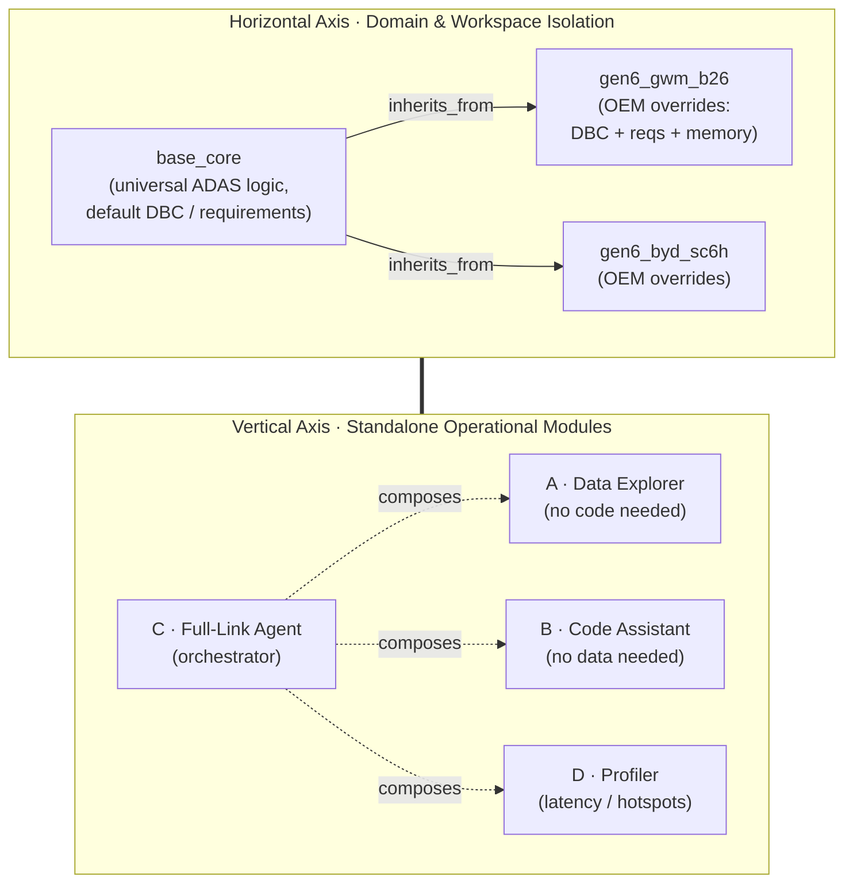
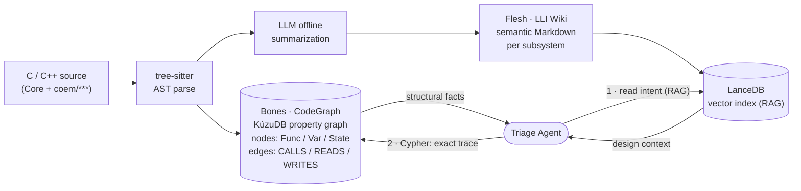
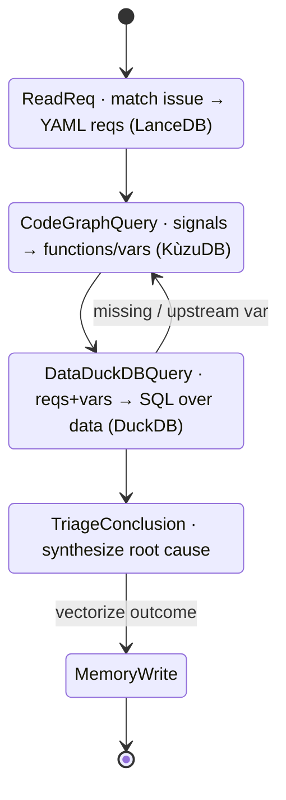
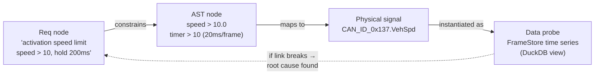
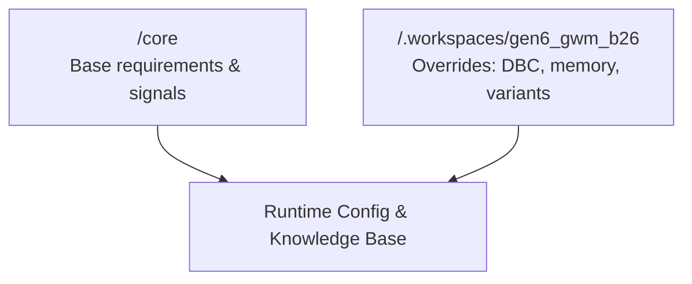
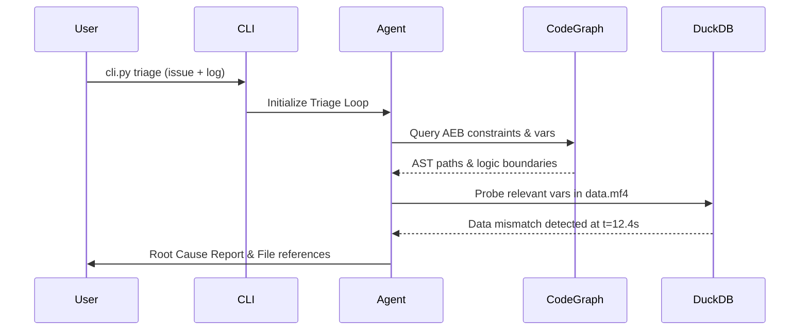
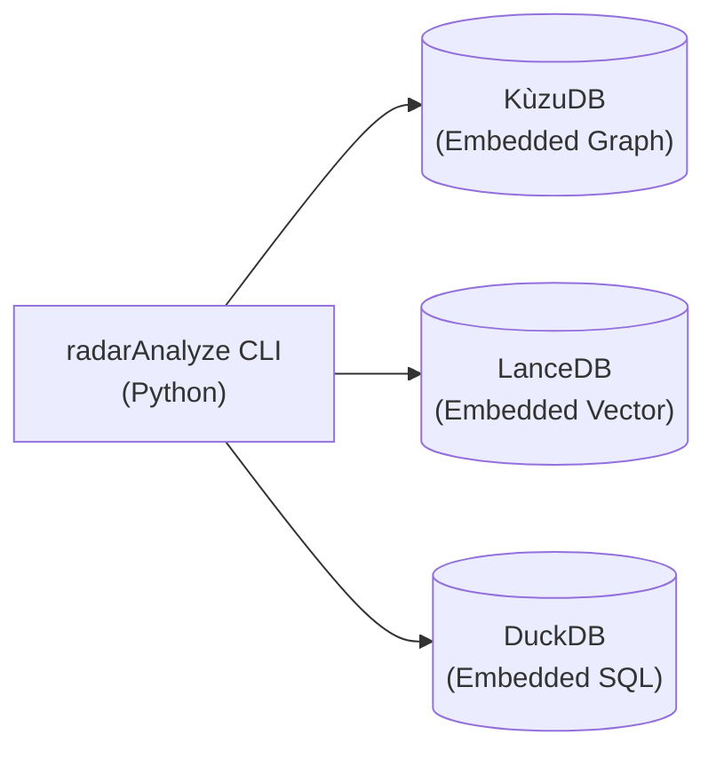

# Master Architecture Overview: radarAnalyze V3

> **Version**: 3.0.0-Master-Design · **Companion designs**: `V3_ARCHITECTURE_DESIGN.md`, `V3_TECH_STACK_AND_DATA_MODEL.md`, `V3_DESIGN_MODULE_DATA.md`, `V3_DESIGN_WORKSPACE_AND_AGENT.md`, `V3_REQUIREMENTS_DESIGN.md`.

### Document Map & Diagram Index

| # | Section | Diagram |
|---|---------|---------|
| 2 | The Matrix Architecture | **Fig. 1** — Matrix (X: Core→COEM inheritance, Y: 4 modules) |
| 3 | "Bones & Flesh" Knowledge Engine | **Fig. 2** — CodeGraph (KùzuDB) + LLI Wiki (LanceDB) |
| 4 | The AI Triage Loop | **Fig. 3** — LangGraph state machine · **Fig. 4** — Traceability ontology |
| 5 | Immutable Tech Stack Blueprint | **Fig. 5** — Layered tech stack |
| 6 | Workspace Isolation & Inheritance | **Fig. 6** — `.workspaces/` resolution |
| 7 | End-to-End Use Cases | **Fig. 7** — Full-link triage sequence |
| 8 | Runtime & Deployment View | **Fig. 8** — Zero-backend local runtime |

---

## 1. System Vision & Context

The **radarAnalyze V3** system is purpose-built as an advanced **"AI Triage" tool** for Advanced Driver Assistance Systems (ADAS) engineers. Its primary mission is to dramatically accelerate the diagnosis and root-cause analysis of vehicle issues captured in standard data logging formats (Bag, BLF, MF4).

By bridging the gap between raw vehicle logs, system requirements, and complex ADAS codebases, radarAnalyze V3 empowers engineers to move from a reported anomaly to a verified code-level diagnosis with unprecedented speed and accuracy. It is designed to operate securely and autonomously in highly regulated engineering environments.

## 2. The Matrix Architecture

The system's structural integrity is maintained through a highly modular **Matrix Design**, ensuring clean separation of concerns, scalability, and strict data governance.

**Fig. 1 — The Matrix Architecture.** The horizontal axis governs *whose* knowledge is loaded (Core vs. inherited COEM overrides); the vertical axis governs *which* standalone capability is invoked. Any module (Y) can run on any workspace (X).



> **Note on module lettering:** this overview names the vertical modules by *capability* (Data Explorer, Code Assistant, Full-Link Agent, Profiler). The companion `V3_ARCHITECTURE_DESIGN.md` letters them A–D by delivery order (A = Code Assistant, B = Data Explorer, C = Full-Link Agent, D = Profiler). Both refer to the same four subsystems.

### Horizontal Axis: Domain & Workspace Isolation
The horizontal layer manages domain knowledge and ensures isolation between different projects and customers.
* **Core Foundation:** The baseline data processing, AI orchestration, and universal ADAS logic.
* **COEM Project Inheritance:** Customer Original Equipment Manufacturer (COEM) projects inherit from the Core. This enables strict **Workspace Isolation**, ensuring that specific OEM configurations, proprietary signals, and bespoke logic remain entirely independent and secure.

### Vertical Axis: Standalone Operational Modules
The vertical layer provides four distinct, standalone toolsets for the engineering workflow:
1. **Data Explorer:** A high-performance module for querying, probing, and visualizing massive, time-series vehicle data logs with zero latency.
2. **Code Assistant:** A deep codebase analysis module that understands structural dependencies and semantic intent within the ADAS source code.
3. **Full-Link Agent:** The orchestrator. An autonomous agent workflow that seamlessly correlates data anomalies, code logic, and system requirements to deduce failure modes.
4. **Profiler:** An integrated performance monitoring system tracking execution metrics and latency across the entire triage pipeline.

## 3. The "Bones & Flesh" Knowledge Engine

A central tenet of radarAnalyze V3 is the total rejection of LLM-hallucinated architectural relationships. The system relies on a rigorous, two-tiered knowledge representation strategy: **"CodeGraph as Bones + LLI Wiki as Flesh."**

* **The Bones (CodeGraph):** The deterministic structural truth of the system. Powered by robust Abstract Syntax Tree (AST) parsing, the CodeGraph is a local property graph that maps out function calls, state transitions, and variable scopes with mathematical certainty.
* **The Flesh (LLI Wiki):** The semantic context. Large Language Models process the codebase to generate rich, semantic Markdown documentation. This "Flesh" wraps the CodeGraph, providing human-readable design intent, summaries, and context-aware Retrieval-Augmented Generation (RAG) capabilities.

**Fig. 2 — Bones & Flesh knowledge engine.** The Agent reads the *Flesh* to understand business intent, then queries the *Bones* (Cypher over KùzuDB) for exact structural facts — never trusting LLM-invented relationships.



## 4. The AI Triage Loop (Req -> Code -> Data)

The triage process is governed by a cyclical, LangGraph-driven autonomous loop that mathematically deduces root causes by traversing three domains:

1. **Requirements (Req):** The loop begins by ingesting formalized system requirements. It establishes the baseline expectation—*"What is the system supposed to do in this scenario?"*
2. **Codebase (Code):** Utilizing the "Bones & Flesh" engine, the agent cross-references the requirements against the implemented logic. It isolates the specific functions, state machines, and variables responsible for the expected behavior.
3. **Data Logs (Data):** Finally, the agent probes the raw vehicle data streams (Bag/BLF/MF4). It compares the actual logged values against the expected states derived from the Code and Requirements to pinpoint the exact moment and location of the failure.

**Fig. 3 — LangGraph triage state machine.** Each node enriches a shared `AgentState`; the `DataDuckDBQuery` node may loop back to `CodeGraphQuery` to trace an intermediary signal further up the AST.



**Fig. 4 — Traceability ontology.** The Agent's first act is to *instantiate* this triangle of relationships. Root cause = the first link that breaks in the data layer.



## 5. The Immutable Tech Stack Blueprint

radarAnalyze V3 is strictly constrained to be a **zero-backend, fully offline, and Windows-friendly** application. Every component of the tech stack is selected to operate entirely on the engineer's local machine, ensuring absolute data privacy and maximum performance.

* **Data Layer:** **DuckDB + Apache Arrow** 
  * Delivers blistering fast, zero-copy querying and aggregation of heavy time-series vehicle logs.
* **Knowledge Graph:** **KùzuDB**
  * An embedded, high-performance property graph database used to store and query the deterministic AST CodeGraph.
* **Semantic Memory:** **LanceDB**
  * A local vector database providing ultra-fast similarity search for RAG over the semantic LLI Wiki markdown files.
* **Schema & Configuration:** **Pydantic + YAML**
  * Enforces strict type validation and requirement structuring, ensuring the AI operates within rigidly defined parameters.
* **AI Orchestration:** **LangGraph**
  * Powers the resilient, stateful, and cyclical agent loops required for the complex Triage workflow.

## 6. Workspace Isolation & Inheritance

The architecture employs a strict directory-based workspace isolation pattern. The system core provides universally applicable logic and models, while individual COEM workspaces override or extend these defaults. 

**Fig. 6 — Workspace resolution.** The configuration and knowledge files cascade from Core to specific COEM.



## 7. End-to-End Use Cases

The matrix architecture exposes the system capabilities via dedicated CLI entry points, supporting zero-setup localized debugging.

### Module A: Code Assistant (No Data Mode)
**Objective**: Interrogate the codebase structure and logic without requiring raw vehicle data.
**CLI Command**:
```bash
python cli.py code-query --workspace gen6_gwm_b26 --query "Where is the AEB activation logic and what are its dependencies?"
```
**Expected Outcome**:
* **Structural trace**: KùzuDB query returns exact file paths and function call hierarchy for AEB activation.
* **Semantic context**: LanceDB returns the design intent from the LLI Wiki.
* **Output**: A comprehensive markdown response listing the involved files, AST nodes, and a summary of the activation logic constraints (e.g., speed > 10 km/h, timer > 200ms) directly derived from code.

### Module B: Data Explorer (No Code Mode)
**Objective**: Rapidly query and visualize heavy time-series vehicle logs (Bag/BLF/MF4) purely as a data investigation.
**CLI Command**:
```bash
python cli.py data-explore --workspace gen6_gwm_b26 --log cases/FCTA001/data.mf4 --query "Show me all frames where CAN_ID_0x137.VehSpd exceeds 50 km/h."
```
**Expected Outcome**:
* **Data extraction**: DuckDB parses and filters the MF4 file via Apache Arrow with zero latency.
* **Output**: An interactive table or generated Plotly chart showing the `VehSpd` signal over time for the identified windows, and an exportable CSV/Arrow snippet of the anomalous frames.

### Module C: Full-Link Agent (Triage Mode)
**Objective**: The core orchestration loops Requirements, Code, and Data to identify the root cause of an anomaly autonomously.
**CLI Command**:
```bash
python cli.py triage --workspace gen6_gwm_b26 --log cases/FCTA001/data.mf4 --issue "The AEB system failed to activate when the vehicle was traveling at 60 km/h and an obstacle was detected at 10 meters."
```
**Expected Outcome**:
* **Req & Code trace**: System extracts expected conditions from requirements and verifies against CodeGraph.
* **Data probe**: Agent automatically constructs SQL queries to probe DuckDB, comparing expected internal states with actual logged CAN/internal signals.
* **Triage Conclusion**: A structured markdown report detailing the *exact* point of failure (e.g., "The upstream variable `radar_confidence` dropped below the 0.8 threshold at timestamp 12.4s, causing `aeb_activation` to evaluate to false in `src/aeb_core.cpp:142`.").

**Fig. 7 — Full-link triage sequence.**



## 8. Runtime & Deployment View

The system is deployed purely as a local dependency bundle on Windows environments.

**Fig. 8 — Zero-backend local runtime.**



