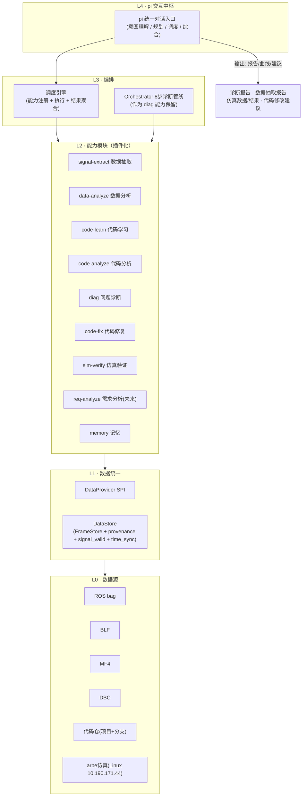
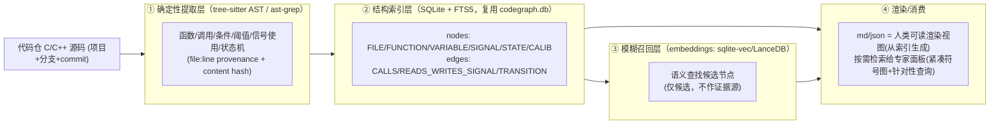

# V4 · pi 驱动的模块化能力架构（顶层设计）

> **版本**: 4.1 · **日期**: 2026-08-27
> **前置**: `CR60_PI_UNIFIED_ARCHITECTURE_REVIEW_2026-08-30.md`、
> `CR60_PI_UNIFIED_SYSTEM_DESIGN.md`（旧版固定诊断管线已收敛为 Pi 能力平台中的可选能力）
> **配套**: `V4_DEVELOPMENT_PLAN.md`（分片开发计划）
>
> **一句话定位**: 把 radarAnalyze 从"固定 8 步诊断管线"演进为 **Pi 唯一产品入口 + registerTool 原子能力 + AI 灵活调度** 的能力平台，任何单一能力可被 Pi 组合，组合后可完成复杂任务（数据抽取、分析、诊断、代码修复、仿真验证、需求分析）。

---

## 1. 背景与目标

### 1.1 演进背景

V3 把项目定型为 **固定 8 步诊断管线**（`Orchestrator.run_diagnosis`）：init → classify → extract → evidence → signals → diagnose → fix → deliver。这套管线对"完整诊断"是有效的，但存在结构性局限：

1. **入口单一**：只能从"问题描述 → 诊断"这一个入口进入，无法支持"帮我抽个信号""分析这段数据分布""验证仿真结果"等细分诉求。
2. **调度静态**：步骤顺序在代码里写死，AI 只能在管线内部做推理，不能根据用户问题动态组合能力。
3. **扩展成本高**：新增能力（如需求分析、仿真验证）需要改管线步骤，而不是加一个独立模块。

与此同时，**Agent 分析能力已经很强**：项目已有 `ReActPlanner`（LLM 规划 + 确定性工具执行）+ `AgentLoop` + `agent_tool_registry`（把 `QueryCanDataTool`/`PlotSignalTool`/`DetectTimePatternTool`/`FindCodeDefinitionTool` 注册为工具）。这为"AI 灵活调度"提供了现成骨架。

### 1.2 目标

- **pi = 统一对话入口与调度中枢**：用户用自然语言提问，pi 理解意图 → 规划 → 灵活组合调度各能力模块 → 综合输出（报告/曲线/建议）。
- **能力插件化**：确定性实现使用 `Engine`，Pi 侧使用 `BaseTool`/`BaseModule` 适配并由 catalog 自动生成 `registerTool`；新增能力 = 实现 + 注册 + contract/test，不改总编排器。
- **数据准确性硬原则**：所有数据带来源溯源（provenance）与信号有效性（signal_valid），无效占位数据不参与判定。
- **知识仅用于定位**：缓存的代码知识/记忆只用于快速缩小排查范围，判定必须基于最新代码 + 准确数据。
- **多源异构支持**：代码仓 / BLF / ROS bag / MF4 / DBC / arbe 仿真，独立或组合均支持诊断分析。

### 1.3 设计原则（写进架构的硬约束）

| 原则 | 说明 | 落地机制 |
|------|------|----------|
| **P1 数据准确性优先** | 无效占位数据（bag 回放时 CAN 恒定值、`signal_valid=0`）绝不能当真实证据 | DataStore 携带 `provenance` + `signal_valid`；消费端只在 valid 时取值 |
| **P2 知识仅定位，不判定** | 缓存知识（L6/manifest/记忆）用于快速定位排查范围；判定看最新代码 + 准确数据 | 证据分级：`localization_hint` vs `deterministic_evidence`；knowledge_guard freshness 门禁 |
| **P3 能力独立 + 可组合** | 每个能力独立可测试，且能被 Pi 组合调度 | `BaseTool`/`BaseModule` + `CapabilityRegistry` + `registerTool` |
| **P4 AI 灵活调度** | pi 根据用户问题动态规划，不依赖固定步骤 | ReAct 风格规划；固定 8 步管线降级为 `diag` 能力之一 |
| **P5 判定可追溯** | 每条结论附证据链（数据来源/代码位置/映射关系） | 统一证据对象 + provenance 贯穿 |
| **P6 arbe 先抽象后远程** | 仿真能力先定义接口 + 本地解析产出，SSH 远程执行后续接 | `ArbeReplayProvider` 抽象 + 远程实现后置 |

---

## 2. 五层架构



### 各层职责

| 层 | 职责 | 关键组件（现状/新增） |
|----|------|----------------------|
| **L4 pi 交互中枢** | 统一对话入口；意图理解 → 规划 → 调度 → 综合输出 | `PiBridge` + generated `registerTool` + `pi` CLI |
| **L3 编排** | 能力注册/发现/执行/结果聚合；保留固定管线作为 diag 能力 | `agent_tool_registry` 扩展；`Orchestrator`（保留）；`CapabilityRegistry` |
| **L2 能力模块** | 插件化独立能力；每个模块独立 CLI + 可组合 API | `ai/modules/*`（BaseModule 体系）+ 各能力模块 |
| **L1 数据统一** | 多源数据归一为统一 DataStore；provenance/signal_valid/time_sync | `parsers/case_loader` + `parsers/frame_store` 扩展 + `DataProvider` |
| **L0 数据源** | 物理数据/代码/仿真入口 | bag_parser / blf_parser / mf4_parser / dbc_loader / code repo / arbe 工具链 |

---

## 3. L4 · pi 交互中枢（详设）

### 3.1 定位

pi 是整个系统的**唯一对话入口**。用户对 pi 说任何话（抽信号、看分布、诊断、改代码、验仿真、查需求），pi 负责：
1. **意图理解**：把用户自然语言映射为"目标 + 可用上下文（哪些数据源/代码仓）"。
2. **规划**：决定调用哪些能力模块、按什么顺序、传什么参数。
3. **调度**：通过调度引擎执行能力模块（每个模块 = 一个确定性工具），收集中间结果。
4. **综合**：把各模块结果聚合成用户要的输出（报告/曲线/建议），附证据链。

### 3.2 基于现有骨架的强化路径

现有骨架已经具备核心能力，pi 是对它的**强化而非重写**：

| 现有组件 | 现状 | pi 强化点 |
|----------|------|-----------|
| `ai/agent/react_planner.py` — `ReActPlanner` | LLM 规划 JSON 步骤 + AgentLoop 执行 | Pi 不可用时的离线/开发 fallback |
| `ai/agent_loop.py` — `AgentLoop` | 确定性执行工具调用 | Pi fallback 和确定性回归复用 |
| `ai/agent_tool_registry.py` — `build_agent_tool_registry` | 提供 legacy deterministic tools | 保留给 AgentLoop/ReAct fallback；Pi 正式目录由 `CapabilityRegistry` + generated Extension + `pi_tool_bridge` 提供 |
| `cli.py` — `_run_module_subcommand` | MODULE_REGISTRY 独立子命令 | 保留（模块独立运行入口）；新增 `pi` 对话模式 |

### 3.3 pi 的三种运行形态

1. **对话形态（主）**：`cli.py pi` 进入交互对话；或 `cli.py pi "帮我抽取车速信号并绘图"` 单轮问答。
2. **编排形态（组合）**：用户问题需要多能力协作时，pi 自动规划调用链（如 抽信号 → 看分布 → 查代码 → 诊断 → 修复建议）。
3. **开发直连形态（fallback）**：维护者可直接调用某能力模块（`cli.py signal-extract ...`），不经过 Pi 规划；用于单测、CI 和故障排查，不是并列的用户产品入口。

---

## 4. L3 · 编排层（能力注册与调度）

### 4.1 能力三件套与 Pi tool contract

所有能力按以下三件套实现，保证"确定性事实 + Pi 可组合 + 开发可独立运行"：

```python
# Engine: deterministic facts, parsers, source/runtime providers
# BaseTool: Pi/Agent callable JSON-in/JSON-out contract
# BaseModule: optional standalone CLI/API wrapper and ModuleResult envelope
```

**注册机制**：`ai/capability/registry.py` 扫描 `MODULE_REGISTRY` + `TOOL_REGISTRY`，生成
catalog；`scripts/gen_pi_extension.py` 为 Pi-visible 能力生成 `registerTool`，执行统一
进入 `ai/capability/pi_tool_bridge.py`。`module_bridge` 只负责 AgentLoop/ReAct fallback。

### 4.2 Pi 自身的代码分析能力边界

Pi 本身具备通用的代码阅读、推理、调用链解释和假设比较能力，但 Pi 的模型能力不能替代
当前项目的源码索引，也不能直接产生运行时事实。正式代码分析采用“Pi 推理 + 当前 source
工具取证”的组合：

```text
Pi 理解问题
  → code-context/code-learn 建立或刷新当前版本索引
  → code-analyze/event-code-path 获取真实函数、caller/callee、条件、参数、变量和输出
  → public runtime/GDB 按当前链路补齐同帧值
  → Pi 按 source 调用关系和源码行号解释条件链、形成假设和下一步
```

`PiBridge` 默认关闭 Pi 内置文件工具（`--no-builtin-tools`），因此模型不能绕过
`registerTool` 自行扫描任意工作区；这保证代码结论来自绑定的 source context。若后续为
特定场景打开内置读文件能力，也必须限制在当前 `PiRunContext.source`，并把读取结果作为
带 provenance 的 artifact，不能绕过 identity/freshness gate。

Pi 每次代码分析必须遵守以下顺序和约束：

1. 先确认当前 data/source/binary/config/replay identity；冲突时停止合并；
2. 先获取当前代码的真实入口和调用链，再按当前 source 实际存在的阶段解释状态机/gate、
   自车、目标、ROI、预测、保持计数和输出；不存在的阶段标记未发现；
3. 每个条件都使用同帧运行时值或当前源码参数，缺值保持 `not_evaluable`，不得由 Pi 猜测；
4. Pi 可以生成“按代码应当报警/不报警”的解释和候选根因，但只能把算法/arbe 报警灯输出
   标成 observed，不能把模型推理升级为 observed；
5. 最终用户输出先给总结结论，再给关键数据表、图和按源码顺序的自然语言命中链路；完整
   工具调用和原始 artifact 进入可展开详情与 Analysis Ledger，不把内部思维链直接展示。

### 4.3 调度引擎

- **能力发现**：启动时扫描 `MODULE_REGISTRY`，收集每个能力的 `name/description/input_schema/tags` 作为 pi 的"工具目录"。
- **执行**：Pi 规划出工具调用后，generated Extension 将 params JSON 转发给 bridge；
  bridge 执行后返回统一 envelope，Pi 再根据 artifact refs 规划下一步。
- **聚合**：中间结果按需传给下一个能力（如 signal-extract 的 store/曲线 → diag 的输入）；最终由 pi 综合成用户要的输出。

### 4.4 固定 8 步管线 = diag 能力

`Orchestrator.run_diagnosis` 完整保留，作为 **`diag` 能力模块** 包装（`DiagModule`）。当用户说"帮我诊断这个案例"时，pi 调度 `diag`；当用户只需要子能力时，pi 只调度对应子能力，不强制走完整管线。这样**管线保留为能力之一**，且不破坏现有行为。

---

## 5. L2 · 能力模块目录

### 5.1 输入 / 能力 / 输出矩阵

| 输入（L0） | 能力（L2） | 输出 |
|-----------|-----------|------|
| ROS bag（雷达内部/点云/warning） | signal-extract / data-analyze / diag / sim-verify | 数据抽取报告(含曲线) / 诊断报告 / 仿真结果 |
| BLF（真实 CAN） | signal-extract / data-analyze / diag | 数据抽取报告 / 诊断报告 |
| MF4 | signal-extract / data-analyze | 数据抽取报告 |
| DBC | signal-extract（信号字典）/ data-analyze（解码） | 信号清单 / 解码数据 |
| 代码仓（项目+分支） | code-learn / code-analyze / diag / code-fix / req-analyze | 代码知识 / 调用链 / 诊断定位 / 修改建议 / gap 报告 |
| arbe 仿真(Linux) | sim-verify / arbe-replay | 仿真后数据 / warning trace / KPI 结果 |
| 客户需求 | req-analyze（未来） | 需求-代码 gap 分析 |

### 5.2 模块清单

| # | 模块 | name | 输入 | 输出 | 依赖 | 独立可运行 |
|---|------|------|------|------|------|-----------|
| C0 | Pi 编排上下文 | `pi-context` | intake/preflight/project/data/policy | `pi-orchestration-context.v1` | JSON artifacts | ✅ |
| C1 | 数据抽取 | `signal-extract` | bag/blf/mf4/store + 模糊查询 | 信号时间线 + CSV + 曲线图 | DataStore | ✅ |
| C2 | 数据分析 | `data-analyze` | store + 窗口/字段 | 统计/分布/窗口/TPE 结果 | DataStore | ✅ |
| C3 | 代码学习 | `code-learn` | 代码仓(项目+分支) | L6 知识/条件/信号映射 | 代码仓 | ✅ |
| C4 | 代码分析 | `code-analyze` | 代码仓 + 符号 | 调用链/依赖/语义 | CodeGraph | ✅ |
| C5 | 问题诊断 | `diag` | 案例 + 问题 + 预期 | 诊断报告(8步管线) | 全部 | ✅ |
| C6 | 代码修复 | `code-fix` | 诊断结论 + 代码 | 代码修改建议(diff) | 代码仓 | ✅ |
| C7 | 仿真验证 | `sim-verify` | bag + arbe | warning trace / KPI / 仿真结果 | arbe-replay | ✅ |
| C8 | 需求分析 | `req-analyze`（未来） | 客户需求 + 代码仓 | 需求-代码 gap 报告 | code-analyze | ✅ |
| C9 | 记忆 | `memory` | 任意上下文 | 记忆读写/召回 | MemorySystem | ✅ |

> **扩展方式**：新增能力 = 新建 Engine（若有）+ `BaseTool`/`BaseModule` + 注册到 registry
> + contract/test；catalog 自动进入 Pi extension。**不改总编排器、不复制 Pi 业务逻辑**。

---

## 6. L1 · 数据统一层（详设）

### 6.1 问题背景（来自 QZH 实战教训）

本次 QZH RCTB 分析暴露了**数据准确性**的关键问题：
- bag 的 `/front/signals`、`/rear/signals` 是 `common_can_signal_publisher` 在 **bag 回放（无真实 CAN）** 时发布的**无效占位数据**：所有信号恒定（`veh_spd=281.53`、`braking_req=1`）、`signal_valid=0`。
- 诊断管线把这些恒定占位值当成了真实证据，得出"RCTB 误触发"的错误结论（置信度 40/100），实际是**雷达内部从未触发 RCTB**。
- 根因：**数据模型层没有 provenance 和 signal_valid**，消费端无法区分"真实信号"与"占位信号"。

### 6.2 DataProvider SPI

每个数据源实现一个 `DataProvider`，统一产出 `CaseLoadResult`（复用现有），并扩展携带 provenance/signal_valid：

```python
# parsers/providers/base.py（设计契约）
class DataProvider(ABC):
    source_kind: str          # "bag" | "blf" | "mf4" | "arbe" | ...
    def load(self, case_dir, config, project_root, workspace=None,
             on_status=None) -> CaseLoadResult: ...
    def provenance(self) -> list[dict]:   # 本 provider 产出数据的来源描述
```

- **BagProvider**：现有 `case_loader` 的 bag 分支强化——deep-parse `wfAutosarData`/`wfObjectMsg`；**新增解码 `/front/signals`、`/rear/signals`（PublicCan 消息）**；对回放占位信号打 `signal_valid=0`。
- **BlfProvider**：现有 blf 分支；DBC 解码真实 CAN，`signal_valid=1`。
- **Mf4Provider**：现有 mf4 分支。
- **DbcProvider**：加载 DBC → 信号字典/枚举/缩放（供 signal-extract 模糊匹配用）。
- **CodeRepoProvider**：代码仓 + 分支 + commit 指纹（供 code-learn/code-analyze/req-analyze）。
- **ArbeReplayProvider**：见 §7.3，仿真产出归一进 DataStore。

### 6.3 DataStore schema 扩展

在现有 `FrameStore` 上做**向后兼容扩展**（新列默认值，不破坏现有查询）：

| 表 | 新增列 | 说明 |
|----|--------|------|
| `bag_frames` | `signal_valid`（TEXT/JSON，或 per-field） | 记录该帧内各信号有效性 |
| `can_frames` | `signal_valid`、`source`（bag_replay/blf_raw） | 区分真实 CAN vs bag 回放占位 |
| `radar_objects` | `source`（已有，wfa/wfo） | 已有 |
| `radar_debug` | `source` | 来源标注 |
| 新增 `signal_catalog` | `signal_name`/`source_kind`/`can_id`/`valid_ratio`/`is_placeholder` | 信号目录：signal-extract 模糊匹配用 |
| 新增 `data_quality` | `signal_name`/`sample_count`/`distinct_count`/`is_constant`/`is_placeholder`/`verdict` | 数据质量审计：恒定/物理不可能值标记 |

**消费端规则（P1）**：`signal_mapper`/`investigation`/`data_probe`/`signal_audit` 只在 `signal_valid=1` 且非占位时取值；`data_quality` 把恒定值/物理不可能值（如 `veh_spd=281.53` 恒定）判为 `is_placeholder=true`。

### 6.4 多源 time_sync 合并

现有 `TimeSync` 已支持 bag/blf 时间对齐（`case_loader.py`）。扩展为**多源统一**：bag/blf/mf4/arbe 产出统一时间轴，任一源缺失时其余源仍可独立分析（bag-only / blf-only 都成立）。

### 6.5 数据流示例

| 场景 | 数据流 |
|------|--------|
| **bag-only** | bag → BagProvider → DataStore（CAN 占位标 invalid，雷达内部真实）→ signal-extract / diag |
| **blf-only** | blf → BlfProvider → DataStore（真实 CAN）→ signal-extract / diag |
| **bag + blf** | 双源 → 各自 provider → time_sync 对齐 → DataStore（bag 雷达内部 + blf 真实 CAN）→ diag（最完整） |
| **bag + arbe** | bag → ArbeReplayProvider（Linux 回放）→ warning trace → DataStore → sim-verify |
| **需求 + 代码** | 需求文档 + CodeRepoProvider → req-analyze → gap 报告 |

---

## 7. 核心能力模块详设

### 7.1 C1 · signal-extract（数据抽取 + 绘图）

**目标**：支持"帮我抽取某某信号"，模糊抽取 + 跨源对齐 + 曲线绘制。

**接口**：
```python
class SignalExtractModule(BaseModule):
    name = "signal-extract"
    input_schema = {
        "query": "str",          # 自然语言或信号名，如 "车速" / "veh_spd" / "rctb_braking_req"
        "case_dir": "str",       # 数据目录（bag/blf/mf4）
        "sources": ["bag","blf","mf4","arbe"],  # 数据源范围（默认全部可用）
        "fuzzy": "bool=True",    # 是否模糊匹配
        "time_range": "[start,end]|None",
        "plot": "bool=True",     # 是否输出曲线
    }
    output_schema = {
        "signals": [...],        # 匹配到的信号清单（含 provenance/signal_valid）
        "csv_path": "str",       # 抽取结果 CSV
        "plot_path": "str|None", # 曲线图路径
        "evidence": [...],       # 证据链
    }
```

**模糊抽取策略**（三级匹配）：
1. **精确/别名匹配**：DBC 信号名 + msgdef 字段名 + `generated_signal_map.py` 信号字典 + 已有 `signal_mapping.json`（内部变量 ↔ CAN）。
2. **语义匹配**：对查询词做 tokenize（如 "车速" → speed/vehicle/veh_spd），用信号字典的字段名/注释/中文映射做相似度。
3. **跨源对齐**：同一物理量在不同源（bag 内部变量 `actual_spd`、CAN `veh_spd`、radar_debug `actual_spd`）之间建立关联，输出统一时间轴曲线。

**绘图**：复用现有 `PlotSignalTool`（`ai/tools/data_tools.py`）能力，输出 matplotlib PNG 或 HTML（嵌入诊断报告）。

### 7.2 C3 · code-learn（代码学习）—— 技术选型：AST → 索引 → 按需检索

> **选型背景**：经社区调研（Sourcegraph/SCIP、CodeQL、ast-grep、Semgrep、aider repo-map、Continue.dev、Cody embeddings、Kùzu/Joern），结论是**分层架构优于"预生成 md + json 文档"**（详见 `V4_DESIGN_CONTEXT_AND_DECISIONS.md` §5.3）。当前生产是 regex + LLM + md/json，且项目**已有休眠的 tree-sitter AST 层**（`ai/codegraph/ast_parser.py`/`ast_builder.py`，`use_ast` 默认 False，生产未启用）。

**目标**：把代码学习从"预生成文档"升级为"可查询结构索引 + 按需检索"，确定性判定用 AST，知识仅作定位。

**四层结构**：



**与现状的关系**：
- **激活休眠 AST**：`CodeGraphBuilder(use_ast=True)` 接入生产（orchestrator._build_codegraph + auto_dream._refresh_codegraph），让信号接口/状态机/模式提取真正产出（regex 下这些边当前为 0）。
- **md/json 降级为渲染视图**：不再作为判定依据的"事实源"；从索引按需生成报告/审计用。
- **embeddings 只做模糊召回**：语义查询召回候选节点 → 再经结构索引确定性验证（对齐"知识仅定位"原则）。
- **专家面板改按需检索**：给紧凑符号图 + 针对性查询，不整篇贴预生成文档。

**接口**：
```python
class CodeLearnModule(BaseModule):
    name = "code-learn"
    input_schema = {
        "code_root": "str",      # 代码仓根
        "branch": "str",         # 分支/commit
        "focus": "str|None",     # 关注功能（如 RCTB）
        "rebuild": "bool=False", # 强制重建索引
    }
    output_schema = {
        "index_path": "str",             # 结构索引（codegraph.db）
        "nodes/edges": "dict",           # 索引统计
        "conditions": [...],             # 确定性提取的条件（AST + provenance）
        "signal_mapping": [...],         # 信号映射
        "knowledge": [...],              # 定位用知识（LLM 从索引按需生成）
    }
```

**依赖**：tree-sitter + tree-sitter-c（C++ 平台 gen5 需 tree-sitter-cpp）；复用已有 `ai/codegraph/`、`engines/signal_mapper.py`、`memory` 基础设施。

### 7.3 C7 · sim-verify / arbe-replay（仿真验证）

**目标**：把 bag 提交到 Linux（10.190.171.44）的 arbe 工具链回放，产出发动机内算法告警轨迹，归一进 DataStore 供诊断/验证。

**接口抽象（P6：先抽象后远程）**：
```python
# engines/arbe/replay_provider.py（设计契约）
class ArbeReplayProvider(ABC):
    def submit(self, case_dir, replay_mode="fctb") -> "JobRef": ...   # 提交回放任务
    def poll(self, job_ref) -> "JobStatus": ...                        # 查询状态
    def fetch_trace(self, job_ref) -> list[dict]:                      # 拉取 warning trace
    def fetch_kpi(self, job_ref) -> dict:                              # 拉取 KPI 结果

class LocalArbeReplayProvider(ArbeReplayProvider):   # 本轮实现：解析已产出的 trace CSV
    def fetch_trace(self, ...):
        # 解析 _algo_warning_trace.csv（event_sec, radar_id, w1..w15）
        # 与 bag_csv_kpi_framesync.py / bag_csv_kpi_batch.py 对齐
        ...

class RemoteArbeReplayProvider(ArbeReplayProvider):  # 后续实现：SSH 到 10.190.171.44
    # 提交 bag → cr60light-arbe-build skill 流程（切 tag/编译/start/回放）
    # 拉回 trace/KPI → 归一 DataStore
    ...
```

**warning trace 格式**（已在 `tools/arbe/FCTB_Batch_Replay_Operation_Guide.md` 定义）：
- `_algo_warning_trace.csv`：`event_sec, radar_id, w1...w15`（w14=LeftFctb, w15=RightFctb）
- 归一进 DataStore 的 `warning_events` / `signal_catalog`，供 diag / data-analyze 消费。

### 7.4 C8 · req-analyze（需求分析扩展示例）

**目标**：用户给客户需求文档（如 DOORS/Excel/文本），pi 调度 code-analyze + diag 分析**代码实现与需求的 gap/偏差**。

**接口**：
```python
class ReqAnalyzeModule(BaseModule):
    name = "req-analyze"
    input_schema = {
        "requirement": "str|path",   # 需求文档
        "code_root": "str",          # 代码仓
        "branch": "str",             # 分支
        "focus": "str|None",         # 关注功能（如 RCTB）
    }
    output_schema = {
        "gap_report": "str",         # 需求-代码 gap 报告
        "requirement_trace": [...],  # 需求追踪（复用 core/materials）
        "violations": [...],         # 偏差项
    }
```

**实现路径**：复用现有 `core/materials`（需求 Schema + trace）+ `code_analyze`（调用链/语义）+ LLM gap 推理。**它是 pi 可扩展性的验证样例**：新增此模块后 pi 自动学会"需求分析"调度，无需改核心。

---

## 8. 系统质量属性（贯穿性设计原则）

> 用户定义的系统定位：**开放的 · 灵活的 · 可靠的 · 鲁棒性高的 · 可插拔模块的 · AI 驱动的数据诊断和代码分析系统**。以下质量属性是每个模块、每层设计必须满足的验收标准。

| 质量属性 | 含义 | 设计落地 |
|----------|------|----------|
| **Q1 开放性** | 能力可被第三方/未来模块扩展，不侵入核心 | `BaseTool`/`BaseModule` + catalog + generated Pi `registerTool` 注册即接入；md/json 不锁定 |
| **Q2 灵活性** | 同一能力可独立运行也可组合；多数据源独立或组合 | 模块独立 CLI + pi 组合调度；DataProvider 多源归一 |
| **Q3 可靠性** | 判定可复现、可追溯、有证据链 | 确定性引擎（AST/正则）+ provenance + freshness 门禁；`deterministic_evidence` 标注 |
| **Q4 鲁棒性** | 单模块失败不拖垮整体；异常有兜底 | `ModuleResult`（never raise）+ `safe_run` 边界 + 降级/空结果；budget.add 空串自动丢弃 |
| **Q5 可插拔** | 增删能力不改核心、不破坏既有行为 | 插件注册 + 工具目录自动发现；V3 模块（M1-M10）保留兼容 |
| **Q6 AI 驱动** | AI 灵活调度能力，而非固定管线 | pi 中枢 ReAct 规划；8 步管线降级为 `diag` 能力 |
| **Q7 可观测** | 调度轨迹、证据、成本可审计 | `ReActTrace` / StepLogger / observability_log.json |

**鲁棒性契约（Q4 具体化）**：
- 任何能力模块的 `run()` 不得抛出未捕获异常 → 必须返回 `ModuleResult`（`ok/data/message/artifacts`）。
- pi 调度某个模块失败 → 记录失败，尝试降级（如无 `signal_valid` 的旧数据源），不中断整个任务。
- 数据源缺失（bag-only / blf-only / 无 DBC / 无代码仓）→ 各自降级为"仅可用能力"，不报错。
- 外部依赖（LLM/arbe/SSH）不可用 → fail-soft：返回部分结果 + 明确 limitation。

---

## 9. 知识策略（P2：知识仅定位，不判定）

### 9.1 两层证据分级

| 层级 | 用途 | 来源 | 可否作判定 |
|------|------|------|-----------|
| **localization_hint（定位提示）** | 快速缩小排查范围 | 缓存记忆/L6/code_knowledge/旧 manifest | ❌ 仅提示 |
| **deterministic_evidence（确定性证据）** | 判定依据 | **最新代码**（当前 commit 的 CodeGraph/conditions）+ **准确数据**（signal_valid=1） | ✅ 可判定 |

### 9.2 落地机制

1. **freshness 门禁**：复用现有 `core/knowledge_guard`——代码 commit/hash 变化使旧 manifest 失配，stale 知识自动失效（fail closed）。
2. **证据标注**：诊断报告/pi 输出中，每条结论标注证据类型（`deterministic_evidence` / `localization_hint`），`localization_hint` 明确标注"定位提示，非判定依据"。
3. **数据准确性前置**：判定前必须过 `data_quality` 审计（§6.3），无效/占位/恒定数据被排除。
4. **按需检索**：专家面板/pi 只接收"紧凑符号图 + 针对性查询结果"，不整篇贴预生成文档（对齐社区 repo-map 模式）。

---

## 10. 能力边界设计（模块化）

### 10.1 原则

每个能力模块有**清晰职责边界**，防止职责重叠、防止模块间隐式耦合：

| 能力 | 职责（只做这些） | 不做（边界外） |
|------|----------------|---------------|
| `signal-extract` | 信号查找/抽取/绘图 | 不做统计结论、不做诊断 |
| `data-analyze` | 统计/分布/窗口/TPE 分析 | 不抽取信号、不做根因 |
| `code-learn` | 代码索引/条件/映射提取（AST） | 不诊断、不修复 |
| `code-analyze` | 调用链/依赖/语义分析 | 不学知识、不修代码 |
| `diag` | 完整 8 步诊断（编排子能力） | 不单独改代码 |
| `code-fix` | 代码修改建议（diff） | 不做数据判定 |
| `sim-verify` | 仿真回放 + KPI/结果验证 | 不做根因推理 |
| `req-analyze` | 需求-代码 gap 分析 | 不做数据诊断 |
| `memory` | 记忆读写/召回/沉淀 | 不直接做分析 |

### 10.2 模块间依赖规则

- 能力模块**只依赖 L1 数据统一层 + 其他能力的公开结果**，不直接互访内部实现。
- 依赖通过 `ModuleResult` 传递（结构化解耦），不共享可变全局状态。
- 新增模块**不得修改既有模块**；通过注册 + 元信息接入 pi 工具目录。
- 模块失败 → `ModuleResult.fail` + limitation，不级联崩溃（Q4）。

---

## 11. 交互设计

### 11.1 交互形态

| 形态 | 入口 | 适用 |
|------|------|------|
| **对话（主）** | `cli.py pi "..."` / 交互式 | 灵活组合、多轮追问 |
| **直连** | `cli.py signal-extract ...` 等 | 单能力确定性调用 |
| **批量** | `cli.py pi --batch questions.json` | 批量处理多问题 |
| **报告** | `report.md/html` | 诊断/抽取/仿真结果交付 |

### 11.2 对话状态与上下文

- pi 支持**多轮对话**：保留会话上下文（用户问题、已选数据源/代码仓/变体、已产出证据）。
- 会话隔离：每个会话独立上下文，不串扰（见 §14 隔离）。
- 交互过程中 pi 可向用户**澄清**（如数据源不明确时询问），而非猜测。

### 11.3 输出呈现

- 数据抽取 → CSV + 曲线图（PNG/HTML）
- 诊断 → `report.md` + `report.html`（证据链 + 置信度 + 修复建议）
- 仿真 → warning trace + KPI 摘要
- 代码修复 → diff 建议
- 需求分析 → gap 报告 + requirement_trace

---

## 12. 多项目适配

### 12.1 多项目模型

系统服务**多个客户/车型项目**（如 BYD SC6H、BYD UKE、GWM B26、XPeng、未来 QZH 等）。每个项目有独立的：
- 代码仓（根路径 + 分支 + commit）
- 数据源（bag/blf/mf4 + DBC）
- 客户需求
- 变体配置（`variants.*`，已有 identity 体系）

### 12.2 适配机制

| 机制 | 现状 | V4 扩展 |
|------|------|---------|
| 变体体系 | `variants.<id>` + `source_context` + `package_profiles`（config.yaml / config.local.yaml） | 保留；能力模块按当前 variant 解析数据源/代码/记忆 |
| 项目识别 | `config.local.yaml` `project_intake` / case 元数据自动选 variant | 保留；pi 在对话开始时确认/推断项目 |
| 数据源切换 | 各 provider 按 case_dir + config 解析 | DataProvider SPI 统一切换 |
| 代码仓切换 | `source_root` + `code_branch` | CodeRepoProvider 统一封装（分支/commit 指纹） |

### 12.3 多项目运行隔离

不同项目在同一实例上运行，**互不干扰**：
- 各自 workspace（`.workspaces/<sanitized_variant>/`）独立
- 各自记忆/知识/索引独立（见 §14）
- pi 会话绑定项目，调度时只加载该项目的能力与数据

---

## 13. 记忆机制与分层

### 13.1 记忆分层（对齐现有 L1-L6）

| 层 | 内容 | 用途 | 可判定性 |
|----|------|------|---------|
| L1-L5 | 案例/会话/模式记忆（memory 表） | 上下文/检索 | localization_hint |
| L6 | 代码知识（code_knowledge JSON）+ 常量 | 定位 | localization_hint |
| 索引 | codegraph.db（AST/正则） | 结构定位 + 证据 | deterministic（fresh 时） |
| 数据 | DataStore（provenance/signal_valid） | 判定依据 | deterministic |

### 13.2 记忆机制

- **写入**：诊断/抽取/仿真完成后，`memory` 能力沉淀可复用知识（按项目隔离）。
- **读取/召回**：pi/诊断通过 `memory_system` 召回（语义记忆 LanceDB + 结构化）。
- **更新/失效**：freshness（代码 commit/hash 变化 → manifest 失配 → 失效重建）。
- **与 pi 结合**：pi 调度前可选加载项目记忆作为定位提示；判定不依赖记忆（P2）。

### 13.3 记忆分层原则

- 记忆**只作定位提示**，不进入确定性判定（P2）。
- 分层的目的：快速命中（L1-L6 记忆）→ 精确定位（索引）→ 确定性判定（最新代码 + 准确数据）。

---

## 14. 多项目记忆隔离 / 数据隔离

### 14.1 隔离原则（硬约束）

不同项目的**记忆、数据、知识、索引必须隔离**，防止串扰污染。这是多项目正确性的前提。

### 14.2 隔离维度

| 维度 | 隔离机制 | 现状 |
|------|---------|------|
| 记忆 | `memory/<project/variant>/` 独立目录（已有 L1-L6 per-variant） | ✅ |
| 代码知识 | `memory/code_knowledge/` + freshness 按项目 hash 隔离 | ✅ |
| 索引 | `.workspaces/<sanitized_variant>/memory/codegraph/codegraph.db` 独立 | ✅ |
| source_docs | `.workspaces/<variant>/source_docs/` 独立 | ✅ |
| 数据缓存 | `.workspaces/<variant>/dbc/` 等独立 | ✅ |
| 会话 | pi 会话绑定项目，独立上下文 | V4 新增 |
| 语义记忆 | LanceDB 按项目命名空间隔离 | 需验证 |

### 14.3 防串扰规则

1. **禁止跨项目回退**：不得因某项目知识缺失而回退到其他项目的全局知识（已写入根 AGENTS.md 知识新鲜度硬约束）。
2. **命名空间强制**：所有记忆/索引/数据缓存路径带项目标识。
3. **manifest 签名**：知识 manifest 绑定项目 + 代码 commit，签名失配即失效。
4. **pi 会话隔离**：会话不得跨项目复用记忆/证据。

---

## 15. L4 · 交互层（CLI 形态）

| 命令 | 说明 |
|------|------|
| `cli.py pi "帮我抽取车速信号并绘图" --case-dir cases/byd_qzh_rctb/` | pi 对话/编排入口（主） |
| `cli.py pi` （无参数） | 进入交互对话 |
| `cli.py signal-extract "车速" cases/byd_qzh_rctb/ --plot` | 直连能力模块（独立运行） |
| `cli.py data-analyze ...` / `cli.py diag ...` / `cli.py sim-verify ...` | 其他能力直连 |
| `cli.py bsd-data-bridge ...`（现有） | V3 既有模块保留 |

---

## 16. 与 V3 的关系

| 维度 | V3 | V4 |
|------|----|----|
| 入口 | 固定 8 步诊断管线 | pi 统一对话入口 + 能力调度 |
| 模块 | 纵向 8 模块（M1-M8，管线内） | 插件化能力模块（C1-C9），可独立可组合 |
| 诊断 | 核心唯一流程 | `diag` 能力之一（保留完整管线） |
| 数据 | FrameStore（无有效性标注） | DataStore（+ provenance + signal_valid + data_quality） |
| 调度 | 静态步骤 | ReAct 风格 AI 灵活调度 |
| 扩展 | 改管线步骤 | 加能力模块 + 注册 |
| 多项目 | variant 体系（已有） | 记忆/数据隔离强化 + pi 会话隔离 |
| 代码学习 | regex + LLM + md/json | AST → 索引 → 按需检索（md/json 降为渲染视图） |

---

## 17. 里程碑路线（详见 V4_DEVELOPMENT_PLAN.md）

- **Slice 0**：设计文档 + AGENTS.md 更新（本轮）
- **Slice 1**：pi 调度中枢（能力 SDK + 工具注册 + 入口）
- **Slice 2**：DataProvider + DataStore 数据统一（provenance/signal_valid/data_quality）
- **Slice 3**：signal-extract 模块（模糊抽取 + 绘图）
- **Slice 4**：arbe-replay 模块（接口 + 本地 trace 解析）
- **Slice 5**：req-analyze 扩展示例
- **Slice 6**：组合编排 + 回归（harness gate + smoke）
